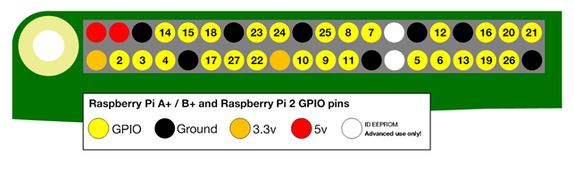

# We-Bot 制御サンプル (距離センサーとの組み合わせ)(C) 2020 KSY
KSY社製のWe-Botを制御するサンプルです。
HC-SR04互換センサーを用います。
## License
このサンプルはMITライセンスで配布します。
MITライセンスの詳細はLICENSE.txtを参照ください。

## ファイル名
- we_bot_pi_demo_sonic.py

## 概要
このサンプルはランダムに旋回しながら走行します。
動作中超音波センサーで検出した値を確認し、一定の距離より近くに障害物を検出したら停止し、向きを変えて走行します。

## 実行方法
実行環境を整えたのちに、以下のコマンドを入力してください。
```
python3 we_bot_pi_demo_sonic.py
```

## 停止方法
動作を止める場合は[Ctrl]キーと[C]キーを同時に押してください。

## センサーの接続方法

超音波センサーは必ず3V対応品を使用してください。Raspberry PiのGPIOは3.3V対応であり、5Vを入力すると故障する恐れがあります。

超音波センサーとGPIOピンを以下のように接続します。
|センサーピン|Raspbeery Pi 端子|用途|
----|----|----
|Vcc|3.3V電源ピン（下図の下段1番左）|電源（間違えて5Vを接続しないよう注意）|
|GND|Groundピン（下図の下段1番右）|グランド|
|Trig|GPIO26（下図の下段右から2番目）|トリガ信号（超音波を出す）|
|Echo|GPIO19（下図の下段右から3番目）|エコー信号（反射した超音波を検出）|




